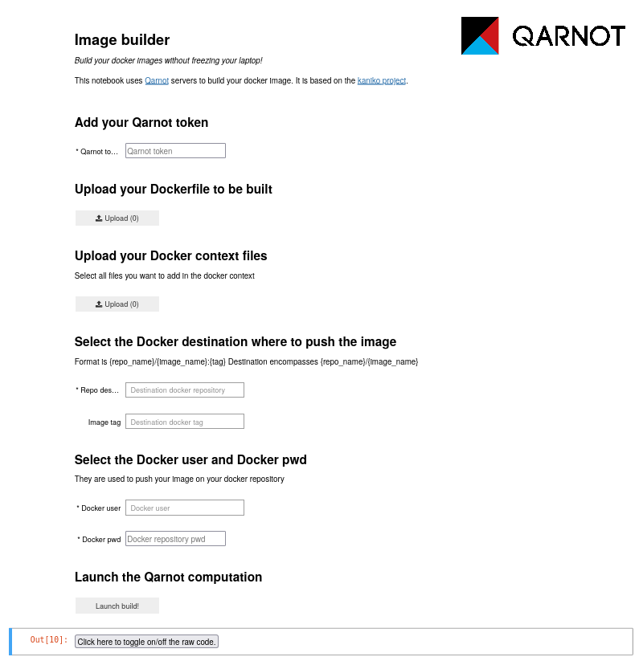

# MVP Kaniko

This project offers a simple interface (through binder) to build a docker image on a qarnot server.

## Content


* `binder`: contains all the necessary files to run the notebook on Binder:
  * `mvp_automl.ipynb`: notebook with graphical interface to launch the build on Qarnot.
  * `postBuild`: post build file specific to Binder, used to set the notebook as trusted on launch.
  * `python_logging.conf`: configuration file to get propper logs when executing the `run_kaniko.py` script.
  * `requirements.txt`: pip requirements file of python modules needed for the use case.
  * `run_kaniko.py`: Python script for launching the task through the Qarnot SDK. Will be executed through the notebook.
* `docker`: all the files necessary to build a proper kaniko image (see [section below](#admin---build-kaniko-docker-image)).
* `input`: input samples to test the interface.
  * `Dockerfile` and `context/` are meant to be used together (the `context/` contains files that will be used during the image build). The `Dockerfile_no_context` is meant to be used on its own.


## How to run

### Prerequisites

* You need to have a docker account to be able to push the image on it once it is built. For this, you just need to sign up on [the docker hub](https://hub.docker.com/). Once it is created, make sure you save your docker login/ID (name of your repository) and your docker password, they will be useful later.
* You need to have a qarnot account (which you can create [here](https://account.qarnot.com/)). On the same page, you will find your secret token, which will be useful later.


### Launch the computation

**From the notebook**

        cd /kaniko/binder

        # Only for the first time the notebook is launched, in order to make it trusted by default
        jupyter trust mvp_kaniko.ipynb

        jupyter notebook mvp_kaniko.ipynb


**From binder**

Access the binder notebook by clicking on the following link: [](https://www.google.com/search?channel=fs&client=ubuntu&q=what+did+you+exect) 


**Filling the form**

You should have the following page load in your browser



* Qarnot token ==> ```my_token```
* Upload Dockerfile ==> ```../input/Dockerfile```
* Upload Docker context files: pick all the files you need for your build context ==> ```../input/context/foo.txt```
* Repository destination ==> ```qarnotlab/test```
* Image tag ==> ```v1```
* Docker user ==> ```qarnotlab```
* Docker pwd ==> ```1234```
* Click on "Launch ```build!"```


### Display the output

The built image will be available in the docker hub, and can be downloaded with the command:

        docker pull qarnotlab/test:v1

Once downloaded, you can use the image the way you want. For instance, you can deploy a container with a shell interface, by running the following command:

        docker run --it -rm qarnotlab/test:v1 bash


# Admin - Test and debug

## Run locally

To build the image described in ```kaniko/input```:

        cd kaniko
        docker run --rm -it -v "$PWD"/input:/job qarnotlab/kaniko:v1 bash
                $ cp -r /job/* /kaniko/.docker/ && /opt/run_kaniko.sh <push_repo> <push_tag> <docker_user> <docker_pwd>

For instance:

        cd kaniko
        docker run --rm -it -v "$PWD"/input:/job qarnotlab/kaniko:v1 bash
                $ cp -r /job/* /kaniko/.docker/ && /opt/run_kaniko.sh qarnotlab/test v1 qarnotlab 1234


## Run on Qarnot

To build the image described in ```kaniko/input```:

        cd kaniko/binder
        python3 run_kaniko.py --token=<token> \
                              --repo=<repo> \
                              --user=<user> \
                              --pwd=<pwd> \
                              --context_path=<context_path> \
                              --tag=<tag>

For instance:

        cd kaniko/binder
        python3 run_kaniko.py --token=my_token \
                              --repo=qarnotlab/test \
                              --tag=v1 \
                              --user=qarnotlab \
                              --pwd=1234 \
                              --context_path=../input


# Admin - Build kaniko docker image

## Prepare build

* clone kaniko git repo: https://github.com/GoogleContainerTools/kaniko
* update ```/deploy/Dockerfile```: remove the entrypoint and start last stage from Debian instead of scratch
* add qarnot_context folder to ```deploy```
==> the result is available in ```docker/kaniko```


## Build

in kaniko project root:

        cd kaniko/docker/kaniko_src
        docker build -t <repo>:<tag> -f deploy/Dockerfile .
        docker push <repo>:<tag>

Image could be reduced (by half) if last stage is from scratch instead of from debian, but easier to have the shell to debug


# Admin - Build binder docker image

* Go to [the binder website](https://mybinder.org )
* Fill in the form with your github information, for instance:
  * github: https://github.com/remibooo/notebook/ 
  * git ref: /
  * path to a notebook file: 01-custom-delayed.ipynb 
* use Copy binder link button and not copy the url directly: https://mybinder.org/v2/gh/remibooo/kaniko_test/HEAD?filepath=mvp_kaniko.ipynb